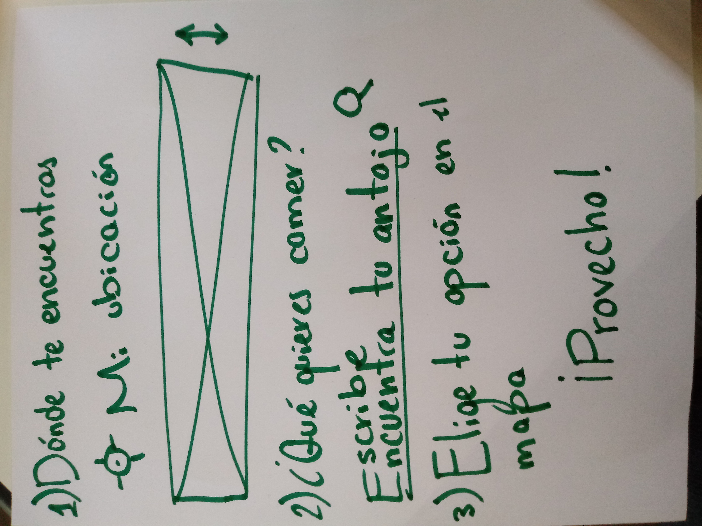

# :fork_and_knife: Yummy Food 

App diseñada para uso en celulares :iphone:, donde puedes buscar 
tu comida favorita y encontrar los restaurantes más cercanos a ti
donde podrás degustarla.  

## :bar_chart: Benchmark 

Benchmark realizado en dos aplicaciones con funcionalidad semejante,
elegidas en base a su éxito y número de usuarios registrados.

### Yelp 

* Fundada en 2004 para ayudar a las personas a encontrar los mejores
  negocios en su localidad. 
* Tiene un promedio mensual de 30 millones de visitantes únicos dentro 
  de la app y 70 millones de visitantes únicos en su versión móvil. 
* Sus usuarios se identifican como Yelpers, los cuales han escrito
  más de 155 millones de reseñas sobre negocios hasta el 2018.

### Foursquare

* Foursquare es una compañía de tecnología que busca usar la ubicación 
  inteligente para ayudar a sus usuarios a descubrir nuevos lugares en
  base a las recomendaciones de otros. 
* Su comunidad está formada por más de 50 millones de personas que hacen
  uso a través del computador y aplicaciones móviles. 
* Con más de 12 mil millones de check-ins, con un récord de más de 9 
  millones de check-ins en un mismo día. 
* Más de 105 millones de lugares mapeados alrededor del mundo.

## :arrow_down: Flujo de la aplicación.

Diseño guiado de forma sencilla e intuitiva, para dar a conocer
a la usuaria a través de la aplicación, por medio de textos breves, 
numerados que le permitirán llegar a su objetivo en el menor
tiempo posible con calma y entendimiento del proceso. 

